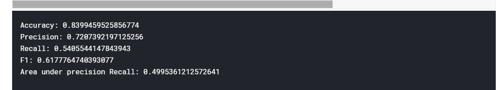

# Data-income-classificationproblem

Go to binaryclassification.pdf for full details

The prediction task is to determine whether a person makes over $50K a year.

### I  used five different classification algorithms:

Decision Tree Classifier

Random Forest Classifier

Logistic classifier

SVM classifier

K Neighbors Classifier

### I evaluated my predictions using different metrics:

Accuracy 

Precision 

Recall 

F1 

Area under precision recall 

### The data  was extracted from the 1994 Census bureau database .

Attributes: >50K, <=50K
age: 
work class: 
education: 
education-num: 
marital-status: 
occupation: 
relationship
race: 
sex: 
capital-gain: continuous
capital-loss: continuous
hours-per-week: continuous
native-country: 

### Results 

Decision Tree Classifier

Random Forest Classifier

Logistic classifier

SVM classifier

K Neighbors Classifier

